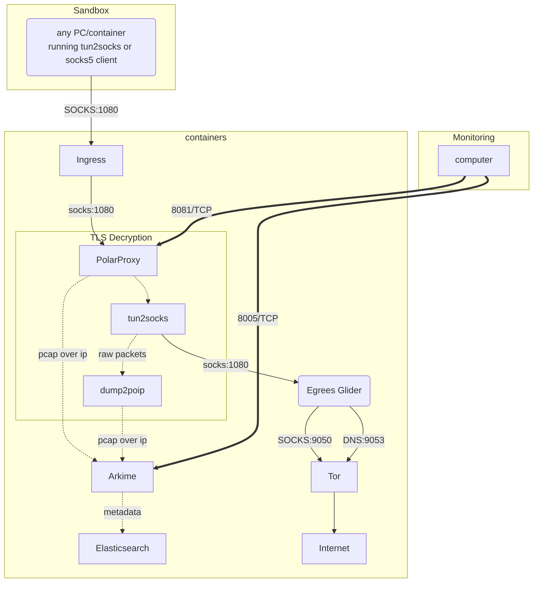

# aio-gw
[EXPERIMENTAL]: All-in-one Network Gateway for Malware analysis. currently at Alpha stage.


HELP NEEDED: if you're keen to contribute to `aio-gw`, ping me! Lots to be done :)

# TODO:

- settings page does not have a way to fetch and save data 
- admin page does not have authentication support
- settings enforcement outside the management component is not done
- outbound options as well as option fields in html are not working



# requirements

A clean VM with `podman` 2.0+ installed. Since AIO-GW works with `nftables`, any `iptables` installation with `nat` table configured will conflict, hence `docker` is not supported

I tested this with Alpine 3.14 and ran the following commands to get the required packages installed and running:

```sh
apk add podman
service podman start
rc-service cgroups start
rc-update add cgroups default
```

Ideally, the VM needs two network intefaces, one for incoming connections, one for outgoing. `aio-gw` will try to set itself up according to current routing table.

enable VM's IP forwarding:

```sh
sudo sysctl net.ipv4.ip_forward=1
sudo sysctl net.ipv6.conf.all.forwarding=1
```

# Default containers running

- Elasticsearch: acts as the main storage backend
- Arkime: packet capture indexing tool
- PolarProxy: performs MITM and pushes the intercepted sessions via pcap-over-ip protocol to Arkime

## Troubleshoot

- delete `nft` tables:

```sh
nft delete table nat
nft delete table ip6 nat
```

- delete rules:

`nft flush ruleset`

- list table rules:

```sh
nft list table nat
nft list table ip6 nat
nft list ruleset
```
- adding postrouting masquarade:

```sh
nft 'add chain nat postrouting { type nat hook postrouting priority 100 ; }'
nft add rule nat postrouting masquerade
```

- create table

```sh
nft add table nat
nft 'add chain nat prerouting { type nat hook prerouting priority -100 ; }'
```

- sample forwarding rule

```sh
nft 'add rule nat prerouting tcp dport 443 counter dnat :10443'
```