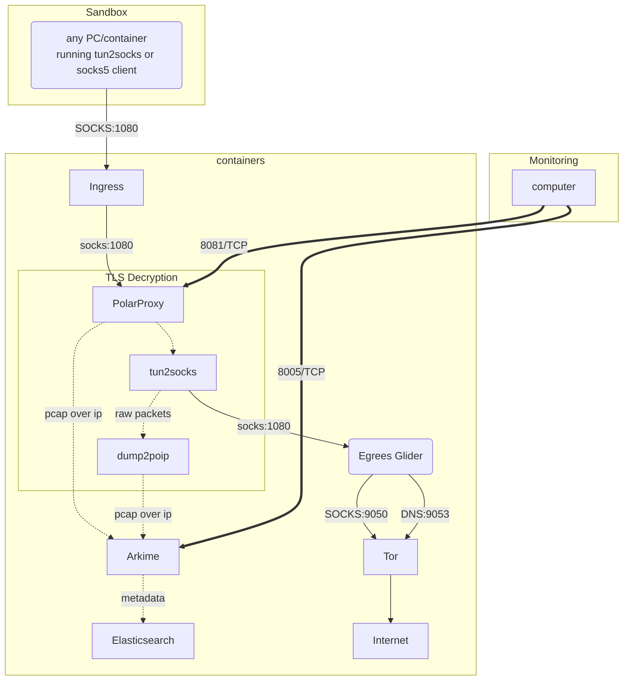

# aio-gw
[EXPERIMENTAL]: All-in-one Network Gateway for Malware analysis. currently at Alpha stage.

HELP NEEDED: if you're keen to contribute to `aio-gw`, ping me! Lots to be done :)

## High level design

## Requirements

A clean VM with docker and either `docker-compose` or `docker compose` installed. minimum 2GB of RAM is required. 

## Installation

- set your desired environment as per the `environment` file
- run `docker compose --env-file ./environment up -d`

within a few moments, you should have all containers up and running and port `1080/TCP` listening on incomming SOCKS5 requests to be terminated/captured.